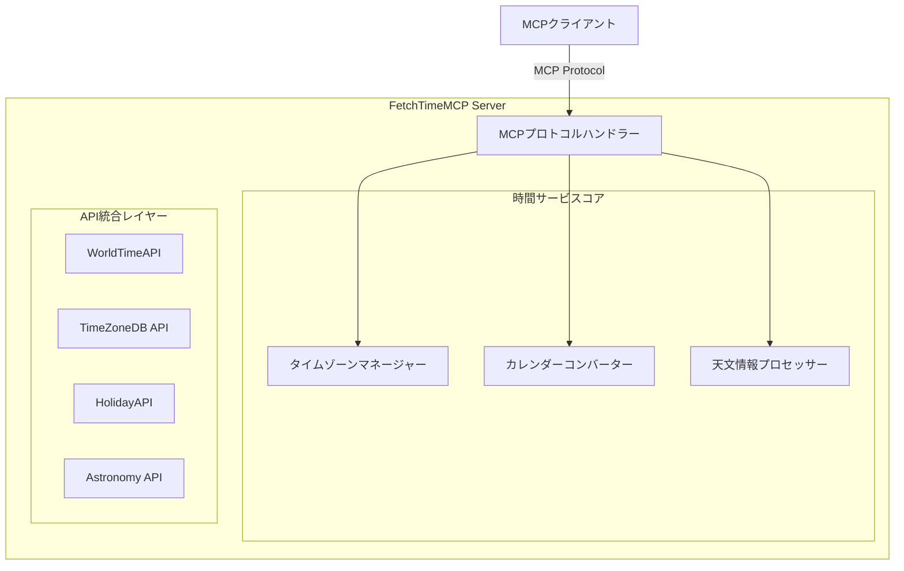

# FetchTimeMCP

包括的な時間・日付情報を提供するMCPサーバー

## 🌍 概要

FetchTimeMCPは、Model Context Protocol (MCP) に準拠した時間・日付情報提供サーバーです。世界中の時間情報を正確に取得し、タイムゾーン、サマータイム、各種宗教的カレンダーに対応した包括的な時間情報サービスを提供します。

## ✨ 主要機能

- 🌐 **グローバル時間取得** - 世界中の任意の地域の現在時刻
- 🕐 **タイムゾーン完全対応** - 全世界のタイムゾーン情報と変換機能
- ☀️ **サマータイム自動対応** - DST（夏時間）の自動検出と調整
- 📅 **宗教的カレンダー対応** - イスラム暦、ユダヤ暦、仏暦、ヒンドゥー暦など
- 🌙 **天文学的時間情報** - 日の出・日の入り、月相情報
- 🎌 **祝日・記念日情報** - 各国の祝日と宗教的記念日

## 📖 ドキュメント

詳細なドキュメントは[docs](./docs)フォルダを参照してください。

- [仕様書](./docs/SPECIFICATION.md) - 詳細な技術仕様
- [Phase 1: 基本実装](./docs/PHASE1_BASIC.md) - 基本機能の実装
- [Phase 2: 高度な機能](./docs/PHASE2_ADVANCED.md) - 宗教暦・天文情報
- [Phase 3: 最適化](./docs/PHASE3_OPTIMIZATION.md) - パフォーマンス最適化

## 🚀 クイックスタート

### 前提条件

- Java 21以上
- Maven 3.8以上
- Claude Desktop App

### インストール

```bash
# リポジトリをクローン
git clone https://github.com/yuu1111/FetchTimeMCP.git
cd FetchTimeMCP

# ビルド
mvn clean compile

# テスト実行
mvn test

# アプリケーション起動
java -jar target/FetchTimeMCP-1.0-SNAPSHOT.jar
```

### Claude Desktop設定

Claude Desktop Appで本MCPサーバーを使用するには、以下の設定を`.claude/claude_desktop_config.json`に追加してください：

```json
{
  "mcpServers": {
    "fetchtime": {
      "command": "java",
      "args": [
        "-jar",
        "C:/Dev/FetchTimeMCP/target/FetchTimeMCP-1.0-SNAPSHOT.jar"
      ]
    }
  }
}
```

#### Windows（PowerShell/CMD）での設定例

```json
{
  "mcpServers": {
    "fetchtime": {
      "command": "cmd",
      "args": [
        "/c",
        "java -jar C:\\Dev\\FetchTimeMCP\\target\\FetchTimeMCP-1.0-SNAPSHOT.jar"
      ]
    }
  }
}
```

#### macOS/Linuxでの設定例

```json
{
  "mcpServers": {
    "fetchtime": {
      "command": "/usr/bin/java",
      "args": [
        "-jar",
        "/home/user/FetchTimeMCP/target/FetchTimeMCP-1.0-SNAPSHOT.jar"
      ]
    }
  }
}
```

### 環境変数（オプション）

現在の実装では外部APIキーは不要です。WorldTimeAPIは無料のパブリックAPIとして利用できます。

```bash
# オプション設定
export MCP_SERVER_PORT=3000  # デフォルト: 3000
export MCP_SERVER_HOST=localhost  # デフォルト: localhost
export CACHE_ENABLED=true  # デフォルト: true
export LOG_LEVEL=INFO  # デフォルト: INFO
```

## 🔧 使用例

### 現在時刻の取得

```json
{
  "tool": "get_current_time",
  "parameters": {
    "timezone": "Asia/Tokyo",
    "calendar": "japanese",
    "include_dst": true
  }
}
```

### 宗教的カレンダー変換

```json
{
  "tool": "get_religious_calendar",
  "parameters": {
    "date": "2024-01-15",
    "calendar_type": "islamic",
    "include_holidays": true
  }
}
```

### 天文学的情報

```json
{
  "tool": "get_astronomical_info",
  "parameters": {
    "latitude": 35.6762,
    "longitude": 139.6503,
    "date": "2024-01-15",
    "include_moon_phase": true
  }
}
```

## 🏗️ アーキテクチャ



## 📅 対応カレンダー

- **グレゴリオ暦** - 標準的な西暦
- **イスラム暦** (Hijri) - ラマダン、イード等の重要日付
- **ユダヤ暦** (Hebrew) - 安息日、過越祭等
- **仏暦** (Buddhist) - ウェーサーカ祭等
- **ヒンドゥー暦** (Hindu) - ディワリ、ホーリー等
- **ペルシア暦** (Persian/Solar Hijri)
- **中国暦** (Chinese) - 旧正月、中秋節等
- **和暦** (Japanese Imperial) - 元号対応

## 🤝 コントリビューション

コントリビューションを歓迎します！以下の手順でお願いします：

1. このリポジトリをフォーク
2. フィーチャーブランチを作成 (`git checkout -b feature/AmazingFeature`)
3. 変更をコミット (`git commit -m 'Add some AmazingFeature'`)
4. ブランチにプッシュ (`git push origin feature/AmazingFeature`)
5. プルリクエストを作成

## 📝 ライセンス

このプロジェクトはMITライセンスの下で公開されています。詳細は[LICENSE](LICENSE)ファイルを参照してください。

## 👥 作者

- **yuu1111** - [GitHub](https://github.com/yuu1111)

## 🙏 謝辞

- WorldTimeAPI - タイムゾーン情報提供
- TimeZoneDB - 詳細なタイムゾーンデータベース
- ICU4J - 国際化カレンダー処理ライブラリ

---

*最終更新: 2024-01-15*