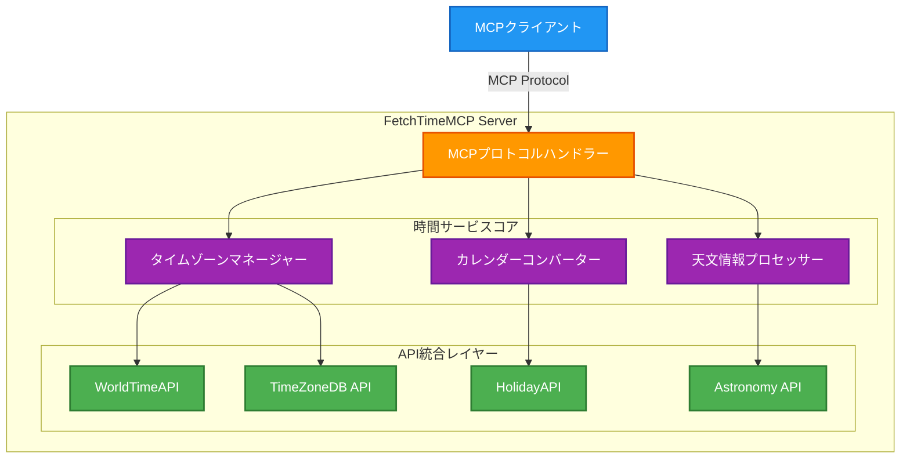
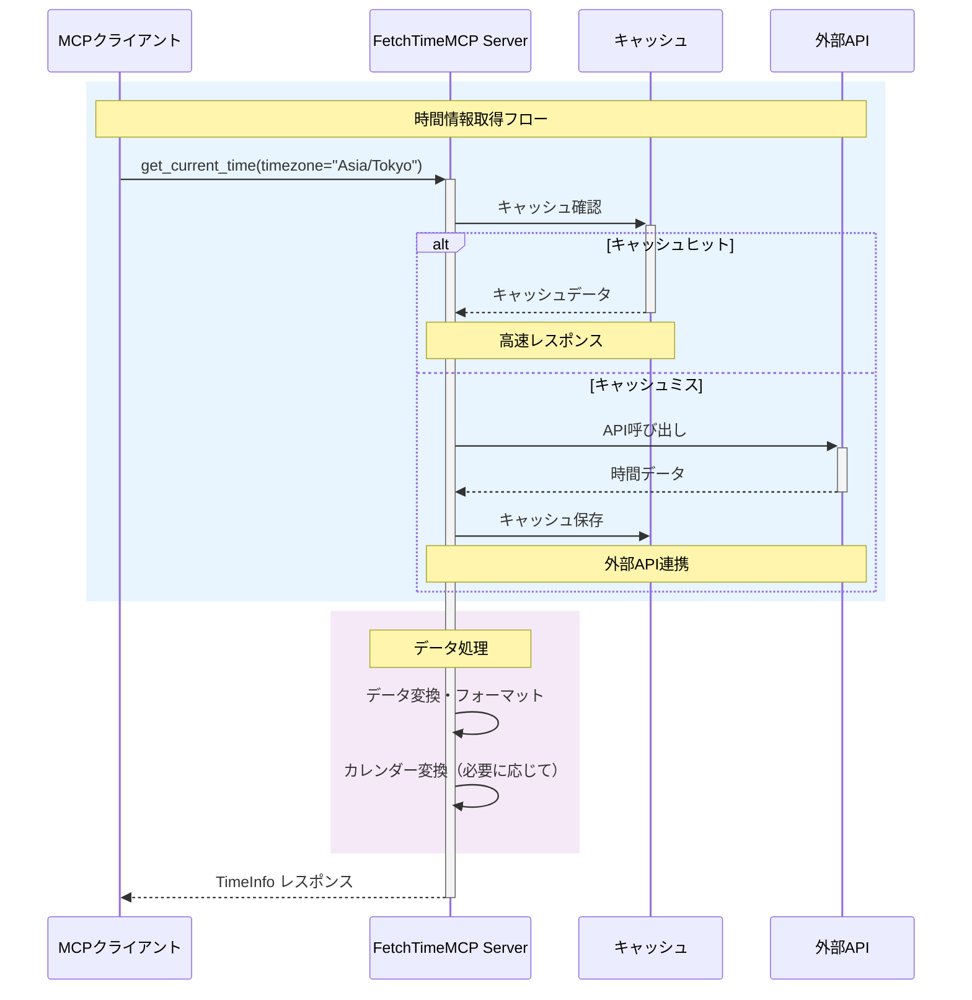
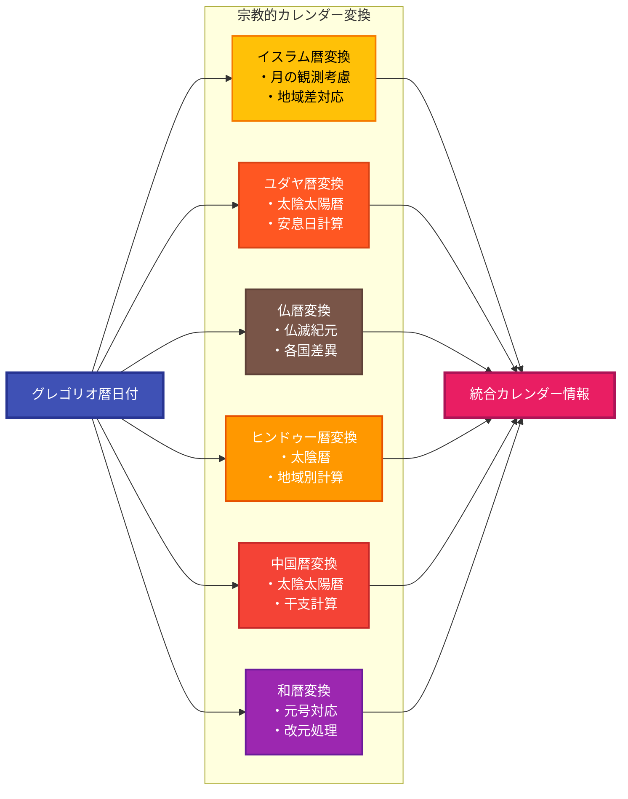

# FetchTimeMCP 仕様書

## 1. プロジェクト概要

### 1.1 目的
FetchTimeMCPは、Model Context Protocol (MCP) に準拠した時間・日付情報提供サーバーです。世界中の時間情報を正確に取得し、タイムゾーン、サマータイム、各種宗教的カレンダーに対応した包括的な時間情報サービスを提供します。

### 1.2 主要機能
- **グローバル時間取得**: 世界中の任意の地域の現在時刻を取得
- **タイムゾーン完全対応**: 全世界のタイムゾーン情報と変換機能
- **サマータイム自動対応**: DST（夏時間）の自動検出と調整
- **宗教的カレンダー対応**: 複数の宗教暦への変換と表示
- **天文学的時間情報**: 日の出・日の入り、月相情報
- **祝日・記念日情報**: 各国の祝日と宗教的記念日

## 2. 技術仕様

### 2.1 システムアーキテクチャ



### 2.2 使用技術
- **言語**: Java 21
- **ビルドツール**: Maven
- **HTTPクライアント**: OkHttp3
- **JSONパーサー**: Jackson
- **MCPライブラリ**: カスタム実装
- **日付処理**: java.time API + ICU4J

### 2.3 データフロー



### 2.4 外部API統合
1. **WorldTimeAPI** (http://worldtimeapi.org/)
   - タイムゾーン別現在時刻
   - DST情報

2. **TimeZoneDB** (https://timezonedb.com/)
   - 詳細なタイムゾーンデータベース
   - DST変更履歴

3. **HolidayAPI** (https://holidayapi.com/)
   - 各国の祝日情報
   - 宗教的記念日

4. **Astronomy API** (https://api.sunrise-sunset.org/)
   - 日の出・日の入り時刻
   - 月相情報

## 3. MCPツール仕様

### 3.1 get_current_time
現在時刻を取得します。

**パラメータ:**
```json
{
  "timezone": "string (optional) - IANAタイムゾーン名 (例: Asia/Tokyo)",
  "format": "string (optional) - 出力フォーマット (ISO8601, RFC3339, UNIX, CUSTOM)",
  "calendar": "string (optional) - カレンダータイプ (gregorian, islamic, hebrew, buddhist, hindu, persian, japanese)",
  "include_dst": "boolean (optional) - DST情報を含むか",
  "include_offset": "boolean (optional) - UTCオフセットを含むか"
}
```

**レスポンス:**
```json
{
  "timestamp": "2024-01-15T14:30:00+09:00",
  "timezone": "Asia/Tokyo",
  "timezone_name": "日本標準時",
  "utc_offset": "+09:00",
  "dst_active": false,
  "unix_timestamp": 1705297800,
  "calendar_info": {
    "gregorian": "2024年1月15日",
    "japanese": "令和6年1月15日",
    "buddhist": "仏暦2567年1月15日"
  }
}
```

### 3.2 convert_timezone
タイムゾーン間で時刻を変換します。

**パラメータ:**
```json
{
  "datetime": "string - 変換する日時",
  "from_timezone": "string - 元のタイムゾーン",
  "to_timezone": "string - 変換先のタイムゾーン",
  "include_dst_info": "boolean (optional) - DST情報を含むか"
}
```

### 3.3 get_religious_calendar
宗教的カレンダー情報を取得します。

**パラメータ:**
```json
{
  "date": "string (optional) - グレゴリオ暦の日付",
  "calendar_type": "string - カレンダータイプ",
  "include_holidays": "boolean (optional) - 宗教的祝日を含むか",
  "include_observances": "boolean (optional) - 宗教的行事を含むか"
}
```

**対応カレンダー:**
- **イスラム暦** (Hijri): ラマダン、イード等の重要日付
- **ユダヤ暦** (Hebrew): 安息日、過越祭等
- **仏暦** (Buddhist): ウェーサーカ祭等
- **ヒンドゥー暦** (Hindu): ディワリ、ホーリー等
- **ペルシア暦** (Persian/Solar Hijri)
- **中国暦** (Chinese): 旧正月、中秋節等
- **和暦** (Japanese Imperial): 元号対応

### 3.4 get_astronomical_info
天文学的時間情報を取得します。

**パラメータ:**
```json
{
  "latitude": "number - 緯度",
  "longitude": "number - 経度",
  "date": "string (optional) - 日付",
  "include_moon_phase": "boolean (optional) - 月相情報を含むか",
  "include_solar_noon": "boolean (optional) - 南中時刻を含むか"
}
```

### 3.5 get_time_difference
2つの地域間の時差を計算します。

**パラメータ:**
```json
{
  "location1": "string - 場所1 (都市名またはタイムゾーン)",
  "location2": "string - 場所2 (都市名またはタイムゾーン)",
  "datetime": "string (optional) - 特定の日時での時差",
  "consider_dst": "boolean (optional) - DSTを考慮するか"
}
```

### 3.6 get_holidays
祝日・記念日情報を取得します。

**パラメータ:**
```json
{
  "country": "string - 国コード (ISO 3166-1)",
  "year": "number (optional) - 年",
  "month": "number (optional) - 月",
  "include_religious": "boolean (optional) - 宗教的祝日を含むか",
  "include_observances": "boolean (optional) - 記念日を含むか",
  "calendar_type": "string (optional) - カレンダータイプ"
}
```

## 4. カレンダー変換フロー



## 5. 特殊考慮事項

### 4.1 タイムゾーンの複雑性
- **政治的変更**: タイムゾーンは政治的決定により変更される
- **地域差**: 同一国内でも複数のタイムゾーンが存在
- **特殊ケース**: ネパール (+05:45)、インド (+05:30) など30分・45分オフセット

### 4.2 サマータイム (DST)
- **地域差**: 北半球と南半球で異なる期間
- **変更日**: 国により開始・終了日が異なる
- **廃止・導入**: 政治的決定により変更される

### 4.3 宗教的カレンダーの特徴
- **月の観測**: イスラム暦は月の観測に基づく
- **太陰太陽暦**: ユダヤ暦、中国暦は太陰太陽暦
- **地域差**: 同じ宗教でも地域により計算方法が異なる

### 4.4 文化的配慮
- **週の始まり**: 日曜日/月曜日/土曜日（地域により異なる）
- **日付形式**: YYYY-MM-DD、DD/MM/YYYY、MM/DD/YYYY等
- **12時間/24時間制**: 地域により異なる
- **数字表記**: アラビア数字、漢数字、デーヴァナーガリー数字等

## 5. エラーハンドリング

### 5.1 エラーコード
- `TIME_001`: 無効なタイムゾーン
- `TIME_002`: 無効な日付フォーマット
- `TIME_003`: API接続エラー
- `TIME_004`: レート制限超過
- `TIME_005`: カレンダー変換エラー
- `TIME_006`: 無効な座標

### 5.2 フォールバック戦略
1. **プライマリAPI失敗時**: セカンダリAPIへ自動切り替え
2. **オフライン時**: ローカルキャッシュから応答
3. **部分的失敗**: 利用可能な情報のみ返す

## 6. パフォーマンス要件

### 6.1 レスポンスタイム
- **基本クエリ**: < 200ms
- **複雑な変換**: < 500ms
- **バッチ処理**: < 2秒

### 6.2 キャッシング戦略
- **静的データ**: タイムゾーンルール（24時間）
- **準静的データ**: 祝日情報（7日間）
- **動的データ**: 現在時刻（キャッシュなし）

## 7. セキュリティ

### 7.1 APIキー管理
- 環境変数での管理
- ローテーション対応
- レート制限の実装

### 7.2 入力検証
- タイムゾーン名の検証
- 日付範囲の制限
- SQLインジェクション対策

## 8. 拡張性

### 8.1 将来的な機能追加
- **ビジネス時間計算**: 営業日・営業時間の計算
- **会議スケジューリング**: 複数タイムゾーン間の最適時間提案
- **歴史的日付**: 過去のカレンダー改革対応
- **カスタムカレンダー**: 企業・組織固有のカレンダー

### 8.2 プラグインアーキテクチャ
- カレンダープロバイダーの追加が容易
- API統合の追加が容易
- カスタムフォーマッターの追加

## 9. テスト戦略

### 9.1 単体テスト
- 各ツールメソッドの個別テスト
- カレンダー変換の精度テスト
- エッジケース（うるう年、DST境界等）

### 9.2 統合テスト
- API連携テスト
- MCPプロトコル準拠テスト
- パフォーマンステスト

### 9.3 国際化テスト
- 各地域のフォーマット検証
- 文字エンコーディング
- 右横書き言語対応

## 10. ドキュメント

### 10.1 開発者向け
- API仕様書
- 実装ガイド
- トラブルシューティング

### 10.2 利用者向け
- クイックスタートガイド
- 使用例集
- FAQ

## 11. ライセンスとコンプライアンス

### 11.1 ライセンス
- MITライセンス
- 外部APIの利用規約遵守

### 11.2 データプライバシー
- 位置情報の取り扱い
- ログの保持期間
- GDPR対応

---

*Version: 1.0.0*  
*Last Updated: 2024-01-15*  
*Author: FetchTimeMCP Development Team*